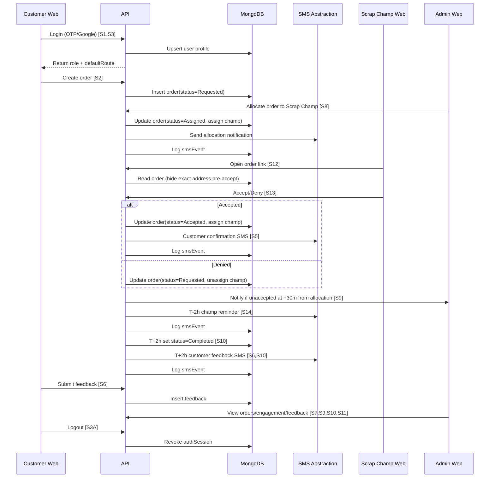
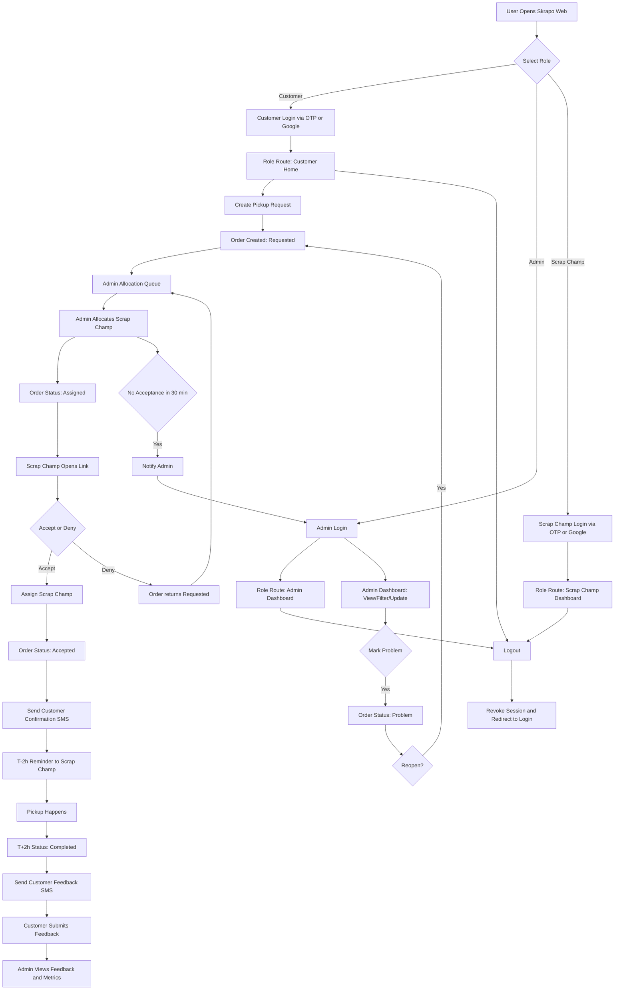

# APP_FLOW

Complete application flow from user roles to architecture interactions, mapped to Stories 1-16 and confirmed clarifications.

## 1) Users, Roles, and Entry Points

- Customer
  - Interface: `apps/customer-web`
  - Auth: OTP or Google with RBAC (Stories 1, 3)
  - Main actions: schedule pickup, view history, submit feedback (Stories 2, 4, 6)

- Admin
  - Interface: `apps/admin-web`
  - Auth: OTP or Google with RBAC
  - Main actions: monitor/manage orders, track engagement, manage problems (Stories 7-11)

- Scrap Champ
  - Interface: `apps/scrap-champ-web`
  - Auth: OTP or Google with RBAC
  - Main actions: open SMS links, view request, accept/deny, view dashboard (Stories 12-14, 16)
  - Story 15 is excluded per clarification.

## 2) End-to-End Business Flow

1. Customer signs in.
   - First-time: OTP/Google, then profile completion with address (Story 1).
   - Returning: direct login to scheduling with saved address (Story 3).
   - Routing rule: authenticated role is redirected to role-specific home screen.

2. Customer creates pickup request (Story 2).
   - Adds scrap types, optional additional types, estimated weights, photo, and pickup slot.
   - API stores order with status `Requested`.

3. Admin reviews new request in allocation queue (Story 8).
   - Admin selects and allocates one Scrap Champ.
   - API updates order status to `Assigned`.
   - Assigned Scrap Champ receives notification/SMS with order link.
   - If no acceptance in 30 minutes from allocation, admin is alerted (Story 9).

4. Scrap Champ opens link and views request (Story 12).
   - Sees general area, schedule, and scrap details.
   - Exact address is hidden until acceptance.

5. Scrap Champ accepts or denies (Story 13).
   - Accept: assign Scrap Champ, status to `Accepted`, reveal exact address, send customer confirmation SMS (Story 5).
   - Deny: status returns to `Requested` and admin reallocates.
   - Reassigned/closed order response: show unavailable message.

6. Pre-pickup reminder is sent at `T-2h` to assigned Scrap Champ (Story 14).

7. Post-pickup automation at `T+2h` (Stories 6, 10).
   - Order status set to `Completed`.
   - Customer feedback SMS sent.

8. Customer submits feedback (Story 6).
   - Rating scale 1-5.
   - Admin can view feedback by order (Story 10).

9. Admin can mark any order as `Problem` and add notes (Story 11).
   - `Problem` can be reopened to `Requested` by admin after intervention.

10. Any authenticated user can logout.
   - Session/refresh token is revoked.
   - User is redirected to login.

## 3) Order Lifecycle Rules

Primary lifecycle:

`Requested -> Assigned -> Accepted -> Completed`

Additional states:
- `New`: admin-created draft only (not used for customer-submitted orders)
- `Problem`: admin-set exception state

Allowed transitions:
- `New -> Requested`
- `Requested -> Assigned`
- `Assigned -> Accepted`
- `Assigned -> Requested` (scrap champ denial/admin reassignment)
- `Accepted -> Completed`
- `New|Requested|Assigned|Accepted|Completed -> Problem` (admin)
- `Problem -> Requested` (admin reopen)

## 4) Runtime Architecture Path

1. Next.js apps call `apps/api` endpoints.
2. API enforces RBAC and business rules.
3. API writes MongoDB (`users`, `roles`, `user_roles`, `orders`, `feedback`, `smsEvents`).
4. API stores and rotates hashed refresh token sessions (`authSessions`).
5. API emits SMS/OTP via abstraction interfaces only.
6. Scheduled jobs run `T-2h` and `T+2h` workflows.

## 5) Sequence Flow (Roles + Architecture)

## 6) End-to-End Flowchart

## 7) SMS and OTP Boundaries

- SMS and OTP provider integrations are intentionally deferred.
- Implementation boundary is provider-agnostic interfaces plus `smsEvents` logging.
- No provider SDK coupling, webhook contracts, or provider-specific payloads in v1.
