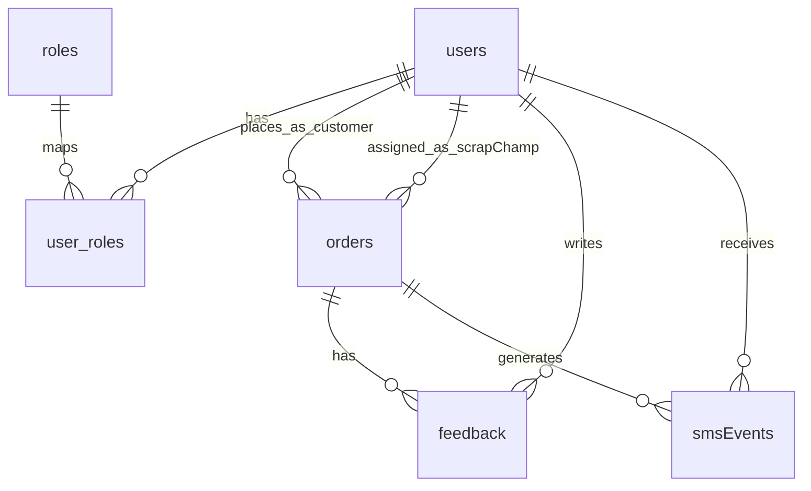

# SCHEMA

MongoDB schema for Skrapo with unified RBAC identity tables:

- `users`
- `roles`
- `user_roles`

Business collections remain:

- `orders`
- `feedback` (customer-only)
- `smsEvents` (abstract logging)
- `authSessions` (refresh token/session lifecycle)

## Scope and Clarifications Applied

- Single user table for the full application.
- Roles are defined centrally and mapped through `user_roles`.
- Story 15 remains excluded per prior clarification.
- Remaining deferred provider-level details are explicitly called out.

## 1) `users` (all application users)

Source: Stories 1-16 + RBAC clarification

| Field             | Type          | Required            | Key              | Reference | Notes                               |
| ----------------- | ------------- | ------------------- | ---------------- | --------- | ----------------------------------- |
| `_id`             | ObjectId      | Yes                 | PK               | -         | User identity                       |
| `mobileNumber`    | String        | Yes for OTP flow    | Candidate unique | -         | OTP login identifier                |
| `email`           | String        | Yes for admin/seed  | Candidate unique | -         | Admin seed identifier               |
| `googleId`        | String        | Yes for Google flow | Candidate unique | -         | Google login identifier             |
| `passwordHash`    | String        | Yes for admin       | -                | -         | For seeded/password users           |
| `name`            | String        | Yes                 | -                | -         | Display name                        |
| `pickupAddress`   | String        | Role-dependent      | -                | -         | Required for customers from Story 1 |
| `serviceArea`     | String        | Role-dependent      | -                | -         | Required for Scrap Champ matching   |
| `serviceGeo`      | GeoJSON Point | Role-dependent      | 2dsphere index   | -         | Required for nearest matching       |
| `serviceRadiusKm` | Number        | Role-dependent      | -                | -         | Default 5 km coverage               |
| `createdAt`       | Date          | Yes                 | -                | -         | Audit                               |
| `updatedAt`       | Date          | Yes                 | -                | -         | Audit                               |

Definition:

- `pickupAddress` (Customer) and `serviceArea` (Champ) use the format: `"Street, City - Pincode"`.
- Current matching logic (Story 17+) uses Pincode extraction and scoring rather than GeoJSON.

## 2) `roles`

Source: role model requirement

| Field       | Type        | Required | Key              | Reference | Notes                             |
| ----------- | ----------- | -------- | ---------------- | --------- | --------------------------------- |
| `_id`       | ObjectId    | Yes      | PK               | -         | Role identity                     |
| `code`      | String enum | Yes      | Candidate unique | -         | `customer`, `admin`, `scrapChamp` |
| `name`      | String      | Yes      | -                | -         | Human-readable role name          |
| `createdAt` | Date        | Yes      | -                | -         | Audit                             |
| `updatedAt` | Date        | Yes      | -                | -         | Audit                             |

## 3) `user_roles` (user-role mapping)

Source: role mapping requirement

| Field       | Type     | Required | Key          | Reference   | Notes       |
| ----------- | -------- | -------- | ------------ | ----------- | ----------- |
| `_id`       | ObjectId | Yes      | PK           | -           | Mapping row |
| `userId`    | ObjectId | Yes      | FK (logical) | `users._id` | Mapped user |
| `roleId`    | ObjectId | Yes      | FK (logical) | `roles._id` | Mapped role |
| `createdAt` | Date     | Yes      | -            | -           | Audit       |
| `updatedAt` | Date     | Yes      | -            | -           | Audit       |

Constraint:

- Unique composite mapping on (`userId`, `roleId`).

## 4) `orders`

Source: Stories 2, 4, 5, 7-14, 16

Order status enum (strict):

- `New`
- `Requested`
- `Assigned`
- `Accepted`
- `Completed`
- `Problem`

| Field                   | Type        | Required | Key          | Reference   | Notes                                         |
| ----------------------- | ----------- | -------- | ------------ | ----------- | --------------------------------------------- |
| `_id`                   | ObjectId    | Yes      | PK           | -           | Order identity                                |
| `customerId`            | ObjectId    | Yes      | FK (logical) | `users._id` | Must map to user with `customer` role         |
| `scrapTypes`            | Array       | Yes      | -            | -           | Includes dropdown + additional types          |
| `estimatedWeight`       | Object      | Yes      | -            | -           | Map of `{ [scrapType: string]: estimatedKg }` |
| `photoUrl`              | String      | No       | -            | -           | Optional upload                               |
| `scheduledAt`           | Date        | Yes      | -            | -           | Pickup slot start                             |
| `scheduledSlotDuration` | Number      | Yes      | -            | -           | 1 hour                                        |
| `generalArea`           | String      | Yes      | -            | -           | Pre-accept visibility                         |
| `exactAddress`          | String      | Yes      | -            | -           | Visible after acceptance                      |
| `location`              | Object      | No       | -            | -           | `{ lat: number, lng: number }` coordinates    |
| `timeSlot`              | String      | Yes      | -            | -           | `any`, `08-10`, `10-13`, `14-16`, `16-19`     |
| `assignedScrapChampId`  | ObjectId    | No       | FK (logical) | `users._id` | Current assigned champ                        |
| `declinedChampIds`      | Array       | No       | -            | `users._id` | History of champs who declined this order     |
| `status`                | String enum | Yes      | -            | -           | Uses strict enum                              |
| `problemNotes`          | String      | No       | -            | -           | Admin follow-up notes                         |
| `createdAt`             | Date        | Yes      | -            | -           | Audit                                         |
| `updatedAt`             | Date        | Yes      | -            | -           | Audit                                         |

Definitions:

- Runtime entry for `New`: admin-created manual draft orders only.
- Customer-submitted orders are inserted directly as `Requested`.
- Allowed transitions:
  - `New -> Requested`
  - `Requested -> Assigned`
  - `Assigned -> Accepted`
  - `Assigned -> Requested` (deny/reassign)
  - `Accepted -> Completed`
  - `New|Requested|Assigned|Accepted|Completed -> Problem` (admin action)
  - `Problem -> Requested` (admin reopen)

## 5) `feedback` (customer-only)

Source: Stories 6, 10; Story 15 excluded

| Field                | Type     | Required | Key          | Reference    | Notes                                 |
| -------------------- | -------- | -------- | ------------ | ------------ | ------------------------------------- |
| `_id`                | ObjectId | Yes      | PK           | -            | Feedback identity                     |
| `orderId`            | ObjectId | Yes      | FK (logical) | `orders._id` | Target order                          |
| `customerId`         | ObjectId | Yes      | FK (logical) | `users._id`  | Must map to user with `customer` role |
| `rating`             | Number   | Yes      | -            | -            | 1-5                                   |
| `weight`             | Number   | No       | -            | -            | Optional customer entry               |
| `price`              | Number   | No       | -            | -            | Optional customer entry               |
| `scrapChampBehavior` | String   | No       | -            | -            | Optional                              |
| `comments`           | String   | No       | -            | -            | Optional                              |
| `createdAt`          | Date     | Yes      | -            | -            | Audit                                 |

Definitions:

- `rating` is required.
- `weight`, `price`, `scrapChampBehavior`, and `comments` are optional.
- `scrapChampBehavior` enum: `Good`, `Neutral`, `Poor`.

## 6) `smsEvents` (abstract event log)

Source: Stories 1, 5, 6, 8, 9, 10, 12, 14

| Field          | Type        | Required | Key          | Reference    | Notes                                                                                                                                      |
| -------------- | ----------- | -------- | ------------ | ------------ | ------------------------------------------------------------------------------------------------------------------------------------------ |
| `_id`          | ObjectId    | Yes      | PK           | -            | Event identity                                                                                                                             |
| `orderId`      | ObjectId    | No       | FK (logical) | `orders._id` | Nullable for OTP-only events                                                                                                               |
| `userId`       | ObjectId    | Yes      | FK (logical) | `users._id`  | SMS/OTP recipient                                                                                                                          |
| `mobileNumber` | String      | Yes      | -            | -            | Target phone number                                                                                                                        |
| `eventType`    | String enum | Yes      | -            | -            | `OTP`, `AllocationAssigned`, `AutoAllocationAssigned`, `AllocationReassigned`, `CustomerConfirmation`, `ChampReminder`, `CustomerFeedback` |
| `status`       | String enum | Yes      | -            | -            | `Queued`, `Sent`, `Delivered`, `Failed`, `Clicked`                                                                                         |
| `linkId`       | String      | No       | -            | -            | For click tracking                                                                                                                         |
| `meta`         | Object      | No       | -            | -            | Generic metadata (OTP/Traces)                                                                                                              |
| `createdAt`    | Date        | Yes      | -            | -            | Audit                                                                                                                                      |

Definition:

- OTP metadata stores masked target, attempt count, and expiry timestamp in generic `meta`.

## 7) `authSessions` (refresh token/session store)

Source: auth/session clarification

| Field              | Type     | Required | Key          | Reference   | Notes                       |
| ------------------ | -------- | -------- | ------------ | ----------- | --------------------------- |
| `_id`              | ObjectId | Yes      | PK           | -           | Session identity            |
| `userId`           | ObjectId | Yes      | FK (logical) | `users._id` | Session owner               |
| `refreshTokenHash` | String   | Yes      | -            | -           | Hashed opaque refresh token |
| `userAgent`        | String   | No       | -            | -           | Optional device signal      |
| `ipAddress`        | String   | No       | -            | -           | Optional network signal     |
| `expiresAt`        | Date     | Yes      | -            | -           | 30-day expiry               |
| `revokedAt`        | Date     | No       | -            | -           | Set on logout/revocation    |
| `createdAt`        | Date     | Yes      | -            | -           | Audit                       |
| `updatedAt`        | Date     | Yes      | -            | -           | Audit                       |

Definitions:

- Store only token hashes, never raw refresh tokens.
- Refresh operation rotates token hash.
- Logout revokes active session by setting `revokedAt`.

## Logical Foreign Keys

- `user_roles.userId -> users._id`
- `user_roles.roleId -> roles._id`
- `orders.customerId -> users._id`
- `orders.assignedScrapChampId -> users._id`
- `feedback.orderId -> orders._id`
- `feedback.customerId -> users._id`
- `smsEvents.orderId -> orders._id`
- `smsEvents.userId -> users._id`
- `authSessions.userId -> users._id`

## RBAC Constraints (Application Level)

- `orders.customerId` must belong to a user mapped to role `customer`.
- `orders.assignedScrapChampId` must belong to a user mapped to role `scrapChamp`.
- Admin-only endpoints must require users mapped to role `admin`.

## ER Diagram

## Required Constraints from Stories

- Initial order status: `Requested`.
- Primary state path: `Requested -> Assigned -> Accepted -> Completed`.
- `Problem` set manually by admin.
- Feedback rating range: 1-5.
- Timers:
  - `T-2h`: Scrap Champ reminder.
  - `T+2h`: Complete order + send customer feedback SMS.

## Open Definitions

- Story 9 no-accept alert window: 30 minutes from admin allocation timestamp.
- Nearest matching logic (Story 17+): Extracts 6-digit Pincode from `pickupAddress` and `serviceArea`. Scores based on:
  - 100: Exact pincode match
  - 80: Neighborhood match (±5)
  - 60: District match (±10)
  - 20: Same city match
  - Random tie-breaker for equal scores.
- Auth token/session persistence model:
  - Access token: JWT, 15-minute TTL.
  - Refresh token: opaque token, 30-day TTL, stored hashed in DB.
  - Rotation on refresh and revoke on logout.
